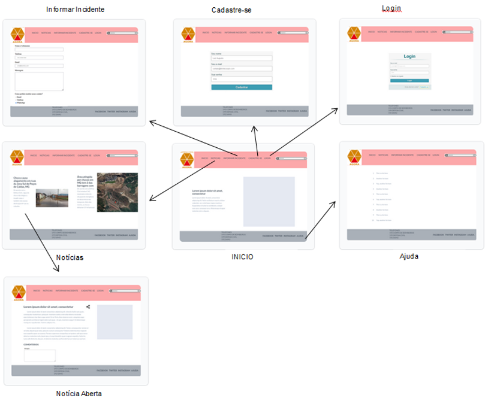
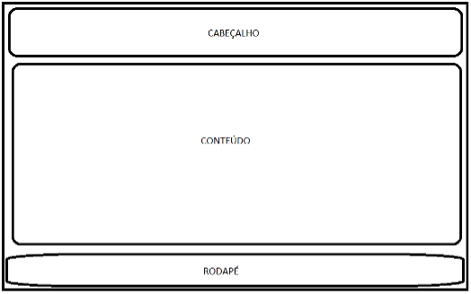
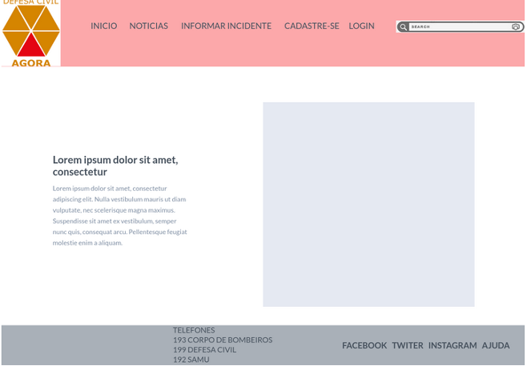
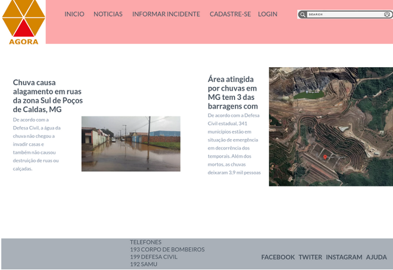
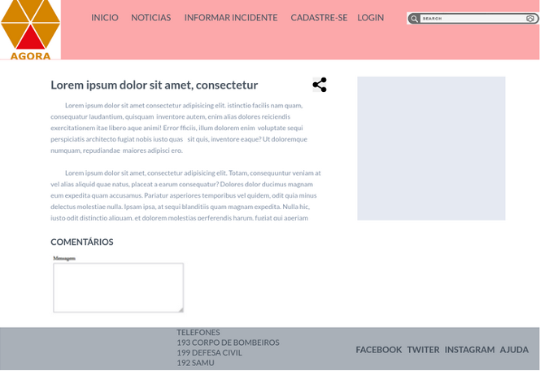
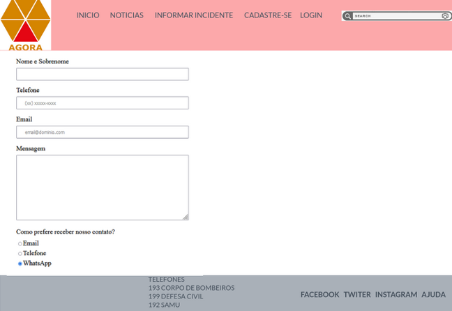
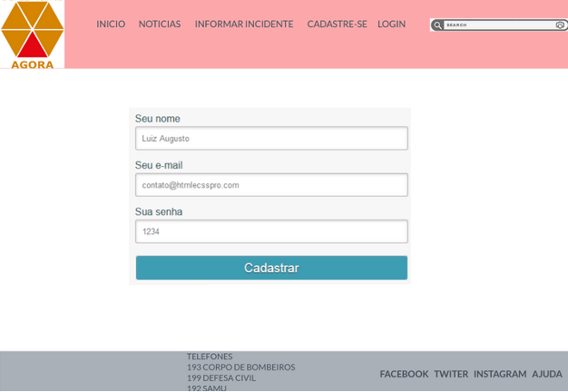
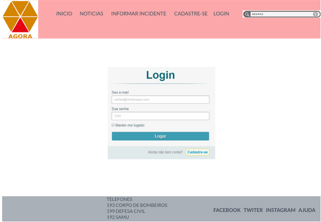
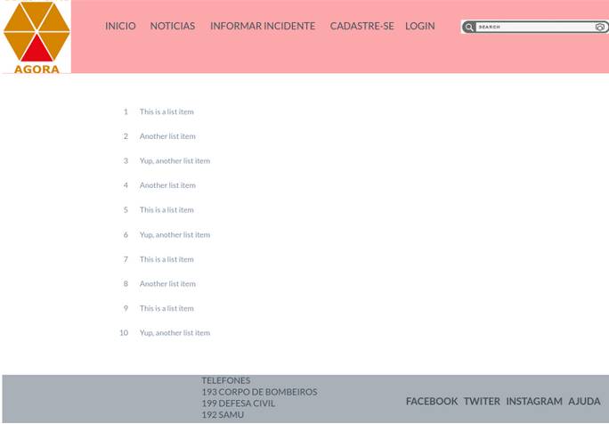

# Projeto de Interface

Dentre as preocupações para a montagem da interface do sistema, estamos estabelecendo foco em questões como agilidade, acessibilidade e usabilidade. Desta forma, o projeto tem uma identidade visual padronizada em todas as telas que são projetadas para funcionamento em desktops e dispositivos móveis.

## User Flow

O diagrama apresentado na Figura X mostra o fluxo de interação do usuário pelas telas do sistema. Cada uma das telas deste fluxo é detalhada na seção de Wireframes que se segue. Para visualizar o wireframe interativo, acesse o ambiente MarvelApp do projeto. (https://marvelapp.com/prototype/612426f/screen/86120135)
   

 

  
Figura 1 - Fluxo de telas do usuário

   

## Wireframes

Conforme fluxo de telas do projeto, apresentado no item anterior, as telas do sistema são apresentadas em detalhes nos itens que se seguem. As telas do sistema apresentam uma estrutura comum que é apresentada na Figura X. Nesta estrutura, existem 3 grandes blocos, descritos a seguir. São eles:
 
-	Cabeçalho - local onde são dispostos elementos fixos de identidade (logo) e navegação principal do site (menu da aplicação);
-	Conteúdo - apresenta o conteúdo da tela em questão;
-	Rodapé - apresenta os elementos de navegação secundária, geralmente associados a informações adicionais.
   

 
   

### Tela - Início

 A tela de Início mostra as principais informações sobre o site, seu objetivo e sua importância na prestação de serviços. 
 
   

 

  
Figura 2 - Tela Inicial

   
 
 ### Tela - Notícias
 
 A tela de Notícias mostra notícias de destaque a partir da API utilizada pelo sistema. Com base na estrutura padrão, o bloco de Conteúdo traz as notícias em destaque (imagem, título, data, fonte e resumo, ícone de compartilhamento).
 
    

 

  
Figura 3 - Tela Notícias

   
 
### Tela - Notícia Aberta
 
 Ao clicar em uma notícia será exibido seu conteúdo integral permitindo ao usuário compartilhar o conteúdo em suas redes sociais além de comentar e ver os comentários de outros usuários.
     

 

  
Figura 4 - Tela Notícia Aberta

   
 
### Tela - Informar Incidente
 
 A tela Informar Incidente permite ao usuário enviar informações sobre incidentes que tenha observado, é solicitado algumas informações pessoais (nome, telefone e e-mail) uma descrição do incidente e a melhor forma de contato (e-mail, telefone, WhatsApp), após o preenchimento o usuário deverá clicar no botão “Enviar”.
      

 

  
Figura 5 - Tela Informar Incidente

   
 
### Tela - Cadastre-se
 
 A tela Cadastre-se permite ao usuário efetuar cadastro para receber informações sobre regiões de interesse e comentar notícias. É solicitado preencher formulário com nome, e-mail e senha e então clicar no botão “Cadastrar”.
       

 

  
Figura 6 - Tela Cadastre-se

   

 ### Tela - Login
 
 A tela Login permite ao usuário efetuar login para comentar notícias e informar incidentes. É solicitado informar e-mail e senha previamente cadastrados, logo após o usuário deve clicar no botão “LOGAR”.
     

 

  
Figura 7 - Tela Login

   
 
### Tela - Ajuda
 
 A tela Ajuda contém as principais perguntas e respostas feitas pelos usuários e permite que o usuário envie sua dúvida caso ela não esteja na lista.
      

 

  
Figura 8 - Tela Ajuda

   
 
 
