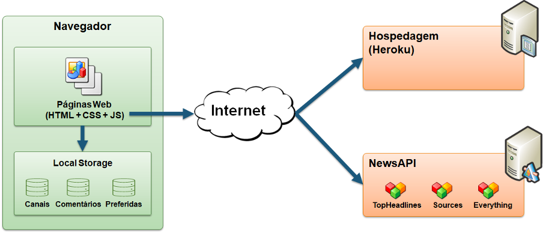

# Arquitetura da Solução

Nesta seção são apresentados os detalhes técnicos da solução criada pela equipe, tratando dos componentes que fazem parte da solução e do ambiente de hospedagem da solução.

## Diagrama de componentes

Os componentes que fazem parte da solução são apresentados na Figura que se segue.
   

 

  
Figura 1 - Arquitetura da Solução

   
 A solução implementada conta com os seguintes módulos:
- Navegador – Será por meio de navegador que as pessoas terão acesso ao site.
  - Páginas Web - As páginas web são um conjunto de arquivos HTML, CSS e JavaScript que são responsáveis pela montagem das páginas, seus estilos e as funcionalidades do sistema.
- Local Storage - armazenamento mantido no Navegador, onde são implementados bancos de dados baseados em JSON. São eles: 
	- Canais - seções de notícias apresentadas 
  - Comentários - registro de opiniões dos usuários sobre as notícias
  - Preferidas - lista de notícias mantidas para leitura e acesso posterior
-	News API - plataforma que permite o compartilhamento das tarefas em redes sociais.
-	Hospedagem - local na Internet onde as páginas são mantidas e acessadas pelo navegador. 
